---
output:
  pdf_document:
    toc: false
    number_sections: true
    fig_caption: true
    latex_engine: xelatex
geometry: a4paper, margin=2.54cm
linestretch: 1.5
fontsize: 12pt
header-includes:
  - \usepackage{authblk}
  - \usepackage{booktabs}
  - \usepackage{longtable}
  - \usepackage{caption}
  - \captionsetup{font=small}
  - \usepackage{setspace}
  - \usepackage{float}
  - \pagestyle{empty}
---

```{r setup, include=FALSE}
knitr::opts_chunk$set(echo = FALSE, warning = FALSE, message = FALSE,
                      fig.width = 7, fig.height = 5, dpi = 150,
                      out.width = "85%", fig.align = "center",
                      fig.pos = "H")
```

# Introduction

Archaeological excavation is a destructive practice whose results cannot be replicated. To minimise interpretive losses, the discipline has developed several formalisms for recording and analysing stratified deposits. Among them, the Harris Matrix (Harris 1989) provides a rigorous deterministic notation for stratigraphic relationships, and remains the principal tool for recording observed contacts between depositional units. Yet many archaeological deposits do not exhibit clean stratigraphy: in **palimpsests** --- deposits where successive occupation phases are vertically and horizontally superimposed and partially intermixed --- the boundaries between phases are often gradual rather than sharp (Bailey 2007; Lucas 2012). The phenomenon is ubiquitous. It affects deeply stratified Near Eastern tells as much as shallow open-air Palaeolithic sites, where millennia of activity are compressed into a few centimetres of sediment. It is equally present in Bronze Age terramare with continuous reoccupation and in multi-period Roman villas, where construction debris and later cemeteries have repeatedly redeposited earlier material.

Disentangling palimpsests requires integrating multiple lines of evidence. Spatial clustering methods such as $k$-means (Kintigh and Ammerman 1982) operate on coordinate data alone and cannot use chronological or typological information. Bayesian phase models for radiocarbon dating (Bronk Ramsey 2009; Crema and Bevan 2021) constrain temporal sequences but ignore spatial proximity. GIS overlays (Conolly and Lake 2006) offer powerful visualisation but no quantitative measure of phase coherence. Recent contributions have provided software tools for spatial exploration of piece-plotted finds (e.g. SEAHORS, Royer et al. 2023; archeoViz, Plutniak 2023), but these focus on visualisation rather than on the assessment of redeposition and the reconstruction of depositional events.

This paper presents \texttt{palimpsestr}, a free and open-source R package and Shiny application that addresses the latter problem. The package implements the Stratigraphic Entanglement Field (SEF) framework, a probabilistic method whose primary goal is to **assign each find a probabilistic score of possible redeposition** with respect to its multivariate context (spatial, vertical, chronological, cultural), and, by aggregation of these find-level scores, to **derive a measure of palimpsest character for each stratigraphic unit and for each grouping of units (depositional event or phase)**. The decomposition is achieved by jointly modelling four evidence domains --- horizontal coordinates, vertical elevation, chronological range, and cultural class --- through a Gaussian mixture model --- whose probabilistic formulation, assumptions, and treatment of the heterogeneous (continuous and categorical) variables are detailed in the Methodological framework below --- which produces soft (probabilistic) assignments of finds to depositional events. From these assignments, three diagnostic statistics quantify deposit coherence, identify potentially redeposited finds, and evaluate the reliability of chronological attribution at the unit and event levels.

The intended archaeological contribution is threefold. First, \texttt{palimpsestr} supports the **interpretive evaluation of stratigraphic units** by quantifying the degree of mixing within each unit: a heavily mixed unit (low purity) may indicate either a genuine palimpsest deposit (e.g. a levelling fill quarried from multi-period contexts) or a recording error (two depositional events conflated under a single US label during excavation). Either way, the diagnostic flags the unit for re-examination. Second, the package detects **intrusive finds** with respect both to their typology and their stratigraphic position, providing a quantitative complement to the standard archaeological inspection. Third, by jointly modelling chronology and cultural class, \texttt{palimpsestr} enables future statistical estimation of **type longevity** -- the duration of use of pottery types, metal artefact forms, or other typologically defined categories -- as a derived product of the inferred phase model.

\texttt{palimpsestr} is freely available under MIT licence on GitHub (\url{https://github.com/enzococca/palimpsestr}). The package supports data import from CSV, TSV, Excel, SQLite, and PostgreSQL (including the PyArchInit database schema widely used in Italian archaeological practice), and provides GIS export to GeoPackage via the \texttt{sf} package, supporting integration with QGIS workflows. A built-in Shiny dashboard (\texttt{launch\_app()}) provides a point-and-click interface for archaeologists without R programming experience.

The remainder of this paper is organised as follows. Section "Methodological framework" introduces the Stratigraphic Entanglement Field formalism, the Gaussian mixture model and its extensions, and the three diagnostic statistics. Section "Software overview" describes installation, package architecture, and the Shiny dashboard. Section "Data preparation" details the data formats and required columns. Sections "Core functions" and "Visualisation" describe the principal model-fitting and plotting functions. Section "Case study: Poggio Gramignano" demonstrates the application on a real-world multi-period Roman villa dataset. Section "Limitations and future development" discusses the package's known caveats, the methodological developments since the first release, and avenues for future work.

# Methodological framework

## Key concepts and definitions

We first fix the vocabulary used throughout, since several of these terms carry more than one meaning in archaeological practice.

A **find** is the elementary unit of analysis: a single recorded archaeological object --- an artefact (e.g.\ a potsherd, a coin, a worked lithic) or an ecofact (e.g.\ a faunal bone) --- carrying its own spatial coordinates, stratigraphic attribution, dating, and typological/material classification. Where finds are not individually piece-plotted, a find inherits the coordinates and dating of its stratigraphic unit (Section "Case study"); the model then operates at unit resolution rather than at the level of the individual object.

A **stratigraphic unit** (US, *unità stratigrafica*) is the basic depositional or interface entity of single-context recording (Harris 1989). Each find belongs to exactly one unit.

The **cultural class** of a find is the categorical label that situates it within a material or typological scheme --- for example its material (ceramic, lithic, metal, bone) or, at finer resolution, a typological category (a ceramic ware, a vessel form, a tool type). In \texttt{palimpsestr} the class is a single nominal variable supplied by the analyst; the choice of scheme (material-based, functional, or typological) is the analyst's, and it determines what "same class" means in the model. By **typology** we mean any such analyst-defined classification of finds into discrete types on formal or functional grounds; it is the source of the cultural-class variable.

By **decomposition** we mean the probabilistic separation of a mixed assemblage into its constituent depositional events: assigning each find a *soft* membership over latent phases, rather than imposing a single hard partition.

The **purity** of a stratigraphic unit is the degree to which its finds belong to a single inferred phase. A **pure** (high-purity) unit has all its finds assigned to one phase; a **low-purity** (heavily mixed) unit has its finds spread across several phases. Purity is read directly from the soft phase assignments and is the unit-level expression of palimpsest character.

We use **palimpsest** in its strictly stratigraphic sense: a deposit in which finds from two or more depositional events are physically superimposed and partially intermixed through taphonomic and post-depositional processes (redeposition, bioturbation, levelling, truncation). This is narrower than the broader, interpretative use of the term for cumulative landscape formation over long time-spans (Bailey 2007). \texttt{palimpsestr} addresses the former --- mixing recoverable from the spatial, vertical, chronological, and typological attributes of individual finds --- and not the latter.

## The Stratigraphic Entanglement Index (SEI)

The Stratigraphic Entanglement Index (SEI) quantifies how strongly two finds $i$ and $j$ are *entangled*, i.e. how much joint evidence supports their co-occurrence within the same depositional event. It is newly proposed here as the pairwise affinity underlying the SEF framework --- it is not drawn from existing literature --- although the individual components (exponential distance kernels, interval-overlap ratios, categorical matching) are standard ingredients of spatial and similarity analysis. For each pair of finds, the SEI is defined as the weighted sum of four contributions:

\begin{equation}
SEI_{ij} = w_s \, e^{-d_{xy}(i,j)/h_{xy}} + w_z \, e^{-|z_i - z_j|/h_{z}} + w_t \cdot O_t(i,j) + w_c \cdot \mathbb{1}[c_i = c_j]
\label{eq:sei}
\end{equation}

where $d_{xy}(i,j)$ is the Euclidean distance in the horizontal plane, $|z_i - z_j|$ is the absolute vertical separation, $O_t(i,j)$ is the chronological overlap ratio computed from the intersection of the temporal ranges $[t_{\min,i}, t_{\max,i}]$ and $[t_{\min,j}, t_{\max,j}]$ relative to their union, and $\mathbb{1}[c_i = c_j]$ is an indicator function equal to 1 when both finds belong to the same cultural class. The spatial and vertical proximities are expressed by bounded exponential kernels with data-driven bandwidths $h_{xy}$ and $h_z$ (the median of the positive pairwise separations on each axis). This formulation, adopted to correct an earlier $1/d$ form, is scale-invariant (independent of the measurement unit of the site grid) and robust to coincident coordinates: two finds recorded at the same grid square no longer collapse every other spatial affinity towards zero. The weights $w_s, w_z, w_t, w_c$ default to unity but allow the analyst to encode prior knowledge about which evidence domains are most reliable for a given site.

Each of the four contributions is independently rescaled to $[0, 1]$ across the dataset --- a min--max normalisation applied separately to each evidence domain (spatial, vertical, chronological, cultural), not per find --- before the weights $w_s, w_z, w_t, w_c$ are applied, so that the domains contribute on a comparable scale. The resulting SEI matrix can be used both as a regularisation term during model fitting (encouraging strongly entangled finds to receive similar phase assignments) and as the basis for the Excavation Stratigraphic Energy diagnostic. Because this rescaling is performed within each dataset, absolute SEI values are not directly comparable across sites.

## The Stratigraphic Entanglement Field (SEF) model

### Modelling objective

The SEF model is an **unsupervised, model-based clustering** of the finds. Its objectives are threefold: (i) to estimate, without any training labels, a small number $K$ of latent depositional *phases*; (ii) to assign each find a *soft* (probabilistic) membership over these phases rather than a single hard label; and (iii) to choose $K$ itself from the data through penalised-likelihood criteria. Soft membership is essential here: in a palimpsest a find genuinely *may* belong to more than one event, and the entropy of its membership vector is precisely the quantity we later exploit as a redeposition signal (Section "Diagnostic statistics").

### Probabilistic formulation

Each find $i$ is represented by a numeric feature vector $\mathbf{x}_i \in \mathbb{R}^p$ together with a categorical class label $c_i \in \{1,\dots,L\}$. The numeric vector concatenates the standardised horizontal coordinates $(x, y)$, vertical coordinate $(z)$, and the midpoint and span of the dating interval $(t_{\text{mid}}, t_{\text{span}})$, so that $p \sim 5$--$8$. We model the pair $(\mathbf{x}_i, c_i)$ as a finite mixture of $K$ phases,

\begin{equation}
f(\mathbf{x}_i, c_i) = \sum_{k=1}^{K} \pi_k \; \underbrace{\mathcal{N}\!\big(\mathbf{x}_i \mid \boldsymbol{\mu}_k, \operatorname{diag}(\boldsymbol{\sigma}_k^2)\big)}_{\text{numeric (Gaussian)}} \; \underbrace{\prod_{\ell=1}^{L} \theta_{k\ell}^{\,\mathbb{1}[c_i=\ell]}}_{\text{class (multinomial)}},
\label{eq:mixture}
\end{equation}

where $\pi_k \ge 0,\ \sum_k \pi_k = 1$ are the mixing weights, $\boldsymbol{\mu}_k$ and $\boldsymbol{\sigma}_k^2$ are the per-phase mean and diagonal variance of the numeric block, and $\boldsymbol{\theta}_k = (\theta_{k1},\dots,\theta_{kL})$ is the per-phase class profile (a probability vector over the $L$ material classes). Equation \eqref{eq:mixture} makes the model's two structural assumptions explicit: (a) conditional on the phase, the numeric features are mutually independent (the covariance is diagonal); and (b) the numeric block and the class label are conditionally independent given the phase, so the joint density factorises into the Gaussian and multinomial terms.

### Treatment of the categorical class variable

Cultural class is a nominal variable and cannot legitimately be treated as a Gaussian coordinate. \texttt{palimpsestr} therefore models it as the **per-phase multinomial** term of Eq.\ \eqref{eq:mixture}: each phase $k$ carries a probability vector $\boldsymbol{\theta}_k$ over the $L$ classes, and the class contributes the factor $\prod_\ell \theta_{k\ell}^{\mathbb{1}[c_i=\ell]}$ to the per-find density. This mixed-type "location model" (a Gaussian-times-multinomial mixture) replaces an earlier scheme in which the class was one-hot encoded into the Gaussian block. The change is consequential. Zero/one dummies treated as Gaussian make finds of different classes almost perfectly separable on the dummy dimensions, which both produced over-confident assignments and, more damagingly, could split a single stratigraphic unit across several phases purely by typology. Under the multinomial model the numeric evidence drives the phase assignment and the class only *tilts* it, so units of mixed material composition remain coherent (Section "Case study"). The per-phase class profiles $\boldsymbol{\theta}_k$ are a directly interpretable by-product, returned by \texttt{phase\_composition()}; a Dirichlet pseudo-count, shrunk towards the global class frequencies, keeps every $\theta_{k\ell}$ strictly positive.

This design also disposes of a dimensionality concern. Because the high-cardinality typological information is absorbed by the multinomial term rather than by the Gaussian block, the numeric feature space stays low-dimensional ($p \sim 5$--$8$) however many material classes the analyst distinguishes. The diagonal-covariance assumption discussed below therefore applies only to a handful of genuinely continuous spatial and temporal features, not to a one-hot-inflated space of dozens of correlated dummy columns.

### Estimation by Expectation-Maximisation

The mixture is fitted by a modified Expectation-Maximisation (EM) algorithm (Dempster et al. 1977). Here $k$-means plays a strictly auxiliary role: it is run on the numeric features only to *seed* the iteration --- with \texttt{n\_init} random restarts (default 5), the best resulting EM solution being retained to mitigate local optima --- and its hard assignments are converted to softmax probabilities. It is not the clustering method itself; all subsequent estimation is performed by the mixture model. The algorithm then alternates an M-step and an E-step until the penalised log-likelihood converges (Algorithm 1).

\noindent\textbf{Algorithm 1 (SEF Expectation-Maximisation).} Given features $\{(\mathbf{x}_i, c_i)\}_{i=1}^{n}$, observation weights $\{w_i\}$ (taphonomic scores, default $1$), and a number of phases $K$:

1. **Initialise** the posteriors $r_{ik}$ from a softmax of negative $k$-means distances (best of \texttt{n\_init} restarts).
2. **M-step.** For each phase $k$, update: the mixing weight $\pi_k \propto \sum_i w_i r_{ik}$; the mean $\boldsymbol{\mu}_k = \sum_i w_i r_{ik}\,\mathbf{x}_i \big/ \sum_i w_i r_{ik}$; the diagonal variance $\boldsymbol{\sigma}_k^2$ as the corresponding weighted second moment (floored at $10^{-6}$); and the class profile $\boldsymbol{\theta}_k = (\mathbf{n}_{k} + \alpha\,\bar{\boldsymbol{\theta}}) \big/ (\sum_i w_i r_{ik} + \alpha)$, where $\mathbf{n}_{k}$ are the weighted class counts in phase $k$ and $\bar{\boldsymbol{\theta}}$ the global class frequencies (the Dirichlet pseudo-count $\alpha$ keeps every $\theta_{k\ell}>0$).
3. **E-step.** Form the log-responsibility of find $i$ for phase $k$ as $\log \pi_k + \log\mathcal{N}\!\big(\mathbf{x}_i\mid\boldsymbol{\mu}_k,\operatorname{diag}\boldsymbol{\sigma}_k^2\big) + \sum_\ell \mathbb{1}[c_i=\ell]\log\theta_{k\ell}$; apply the stratigraphic and neighbourhood corrections (below); then normalise across $k$ by softmax to obtain the updated posteriors $r_{ik}$.
4. **Iterate** steps 2--3 until $|\Delta \log L| < 10^{-5}$ or the maximum number of iterations (\texttt{em\_iter}) is reached.

Two corrections enter the E-step (step 3). The **stratigraphic constraint** adds a penalty $-P_{ik}$ that raises the cost of assigning a find to a phase incompatible with its unit's Harris relations; the optional **Neighborhood-EM field** adds $+\beta\sum_{i'} A_{ii'}\,r_{i'k}$, rewarding agreement with the current posteriors of the find's context-mates ($A$ being a row-normalised same-context affinity matrix). When a noise component is requested, a uniform background is appended as a $(K{+}1)$-th column (next subsection). The four domain weights $w_s, w_z, w_t, w_c$ multiply the corresponding standardised feature dimensions before fitting, so they enter the mixture likelihood directly and can be tuned by cross-validation (\texttt{optimize\_weights()}). Finally, the reported log-likelihood, BIC and ICL are recomputed at the converged parameters from the *unpenalised* mixture density of Eq.\ \eqref{eq:mixture}, so that comparisons across $K$ and across settings remain well posed.

### Optional refinements

Several optional refinements extend the basic model. **Taphonomic weighting**: when a per-find taphonomic integrity score (taf\_score, $0$ = fully disturbed to $1$ = pristine in situ) is supplied, it down-weights poorly preserved items in the M-step, reducing their influence on the phase parameters. **Stratigraphic constraint**: the context/Harris structure is incorporated as a soft penalty on the E-step posterior; it may be applied statically or, with \texttt{strat\_dynamic = TRUE}, as a Neighborhood-EM / hidden-Markov-random-field term recomputed from the current posteriors at every iteration (Ambroise and Govaert 1997), which rewards each find for sharing its unit's phase. **Chronological uncertainty**: with \texttt{chrono\_uncertainty = TRUE} the dating-interval width of each find is propagated into the temporal likelihood as a measurement variance $(t_{\max}-t_{\min})^2/12$, so coarsely dated finds rely less on chronology. **Noise component**: with \texttt{noise = TRUE} a uniform background component (Fraley and Raftery 1998) is added; finds that fit no phase accumulate posterior on it, yielding a genuine outlier probability (Section "Diagnostic statistics") and keeping extreme finds out of the phase estimates.

### Why a diagonal covariance?

The diagonal-covariance assumption --- conditional independence between the numeric features within each phase --- is a deliberate parsimony choice. With typical archaeological datasets ($n = 50$--500 finds and the low-dimensional numeric block above), a full $p \times p$ covariance per phase would add $K\,p(p-1)/2$ free parameters and invite overfitting; the BIC criterion used for model selection penalises exactly this and favours the diagonal model when data are limited. We state the assumption's limit explicitly: in a much richer *continuous* feature space ($p \gg 20$ --- for instance many simultaneously continuous morphometric, compositional, and functional measurements with strong mutual correlations) the diagonal model would be too restrictive, and a full- or structured-covariance variant should be preferred. That regime does not arise in the present design, precisely because categorical information is handled multinomially rather than folded into the Gaussian block (see "Treatment of the categorical class variable" above); full-covariance variants are nonetheless flagged as future work (Section "Limitations and future development").

## Diagnostic statistics

Beyond the SEI matrix defined above, the analysis yields four find- and assemblage-level diagnostics --- three derived from the fitted phase posteriors and one (ESE) computed directly from the data. Throughout, $p_{ik}$ denotes the soft posterior probability that find $i$ belongs to phase $k$ (the rows of \texttt{\$phase\_prob}).

**Excavation Stratigraphic Energy (ESE).** ESE measures, for each find, how dissimilar it is from its spatial neighbours across all four evidence domains. Crucially, it is computed directly from the recorded attributes, *independently of the fitted phases*. Writing $N(i)$ for the set of neighbours of $i$ (all finds within a distance threshold, or all other finds when none is set) and reusing the four affinities of the SEI (Eq.\ \eqref{eq:sei}),

\begin{equation}
\mathrm{ESE}_i = \frac{1}{|N(i)|}\sum_{j\in N(i)} \Big[\beta_s\big(1-e^{-d_{xy}(i,j)/h_{xy}}\big) + \beta_z\big(1-e^{-|z_i-z_j|/h_{z}}\big) + \beta_t\big(1-O_t(i,j)\big) + \beta_c\big(1-\mathbb{1}[c_i=c_j]\big)\Big],
\label{eq:ese}
\end{equation}

that is, the local mean over the neighbourhood of the four *dissimilarities* --- each the complement $1-(\text{SEI component})$ of the corresponding SEI affinity, with weights $\beta$ defaulting to unity. A high ESE marks a find sitting among neighbours unlike it in space, depth, date, or material: a local signature of depositional disruption, bioturbation, or post-depositional displacement. Because ESE depends only on the data and not on the phase labels, it provides a model-independent cross-check on the phase decomposition.

**Shannon entropy.** The entropy of a find's phase-probability vector,

\begin{equation}
H_i = -\sum_{k=1}^{K} p_{ik}\,\log p_{ik},
\label{eq:entropy}
\end{equation}

is low when the assignment is confident and high when the find sits ambiguously between phases or within a heavily mixed zone.

**Palimpsest Dissolution Index (PDI).** A single global statistic summarising assemblage-level separability,

\begin{equation}
\mathrm{PDI} = 1 - \frac{\bar{H}}{\log K},
\label{eq:pdi}
\end{equation}

where $\bar{H}$ is the mean entropy across finds. PDI ranges from $0$ (complete mixing: every find is equally likely to belong to any phase) to $1$ (perfect separation); values above $0.7$ generally indicate well-resolved phases.

**Intrusion score.** A per-find probability of being out of context. When the model is fitted with a noise component (\texttt{noise = TRUE}) this is the posterior probability of the uniform background component --- a genuine probability that, unlike a rescaled composite, is not forced onto $[0,1]$ and need not flag any find when the assemblage is clean. Otherwise it falls back to a heuristic composite of high entropy, high ESE, and low SEI connectivity. The accompanying \texttt{detect\_intrusions()} output also classifies each flagged find by the \emph{direction} of its chronological mismatch with its stratigraphic unit --- \emph{older-than-context} (likely residual material) or \emph{younger-than-context} (a possible unrecognised cut or intrusion, i.e.\ a latent feature) --- together with the signed offset in years.

# Software overview

\texttt{palimpsestr} is an R package distributed under the MIT licence. It is freely available on GitHub at \url{https://github.com/enzococca/palimpsestr} and permanently archived on Zenodo (DOI: \url{https://doi.org/10.5281/zenodo.19881542}). Installation requires R $\geq$ 4.1.0 and can be performed directly from the GitHub source via the \texttt{remotes} package:

\bigskip

\noindent\fbox{\parbox{\dimexpr\linewidth-2\fboxsep-2\fboxrule\relax}{
\texttt{install.packages("remotes")} \\
\texttt{remotes::install\_github("enzococca/palimpsestr")}
}}

\bigskip

The package depends only on base R (\texttt{stats}, \texttt{utils}, \texttt{graphics}, \texttt{grDevices}); optional functionality is provided through suggested packages: \texttt{ggplot2} and \texttt{viridis} for publication-quality plots, \texttt{plotly} for interactive visualisation, \texttt{sf} for GIS export, \texttt{DBI} with \texttt{RSQLite} or \texttt{RPostgres} for database connectivity, and \texttt{shiny}, \texttt{shinydashboard} and \texttt{DT} for the interactive dashboard. The optional dependencies are checked at runtime; functions that require them issue an informative error if the corresponding package is not installed.

The package architecture is modular: data import is handled by \texttt{read\_db()} and \texttt{load\_geometries()}; the core analytical engine by \texttt{fit\_sef()} (Section "Core functions"); diagnostics by \texttt{pdi()}, \texttt{detect\_intrusions()}, \texttt{us\_summary\_table()}, and \texttt{phase\_transition\_matrix()}; visualisation by \texttt{plot\_*()} (base R) and \texttt{gg\_*()} (\texttt{ggplot2}) functions; and reporting by \texttt{report\_sef()} which produces interpretive summaries in English or Italian. A complete list of exported functions is provided in the package manual (\texttt{?palimpsestr}).

## The Shiny dashboard

For users without R programming experience, the package includes a built-in Shiny dashboard, launched with:

\bigskip

\noindent\fbox{\parbox{\dimexpr\linewidth-2\fboxsep-2\fboxrule\relax}{
\texttt{library(palimpsestr)} \\
\texttt{launch\_app()}
}}

\bigskip

The dashboard provides six tabs covering the entire analytical workflow: **Data**, for importing CSV, TSV, Excel, SQLite, or PostgreSQL data and mapping columns to the required schema (with an optional panel for merging external taphonomic scores); **Analysis**, for selecting model parameters and running the fit, with separate controls for phase count selection (\texttt{compare\_k}); **Plots**, for interactive visualisation via \texttt{plotly}; **Tables**, for browsing phase assignments, intrusion scores, per-US purity, and the transition matrix; **Maps**, for overlaying results on uploaded excavation plan geometries (GeoPackage, GeoJSON or shapefile); and **Report**, for generating interpretive reports and downloading results as CSV or ZIP archives.

# Data preparation

## Required columns

\texttt{palimpsestr} requires tabular data in which each row represents a single archaeological find. The mandatory columns are:

- $x, y$: horizontal coordinates (numeric, in any consistent reference system);
- $z$: vertical coordinate (numeric, depth or elevation);
- $t_{\min}, t_{\max}$: lower and upper bounds of the chronological interval (numeric, with negative values for BCE);
- $c$: cultural class (character, e.g. ceramic type or material category).

Two optional columns are supported:

- *context*: stratigraphic unit identifier (character), used for context-based penalties and per-US summaries;
- *taf\_score*: taphonomic integrity score (numeric in $[0, 1]$), used for taphonomic weighting.

The package's auxiliary function \texttt{archaeo\_sim()} generates synthetic datasets with these columns plus a known *true\_phase* label, used both in the package's automated tests and as a controlled validation benchmark. The generator is fully specified, so that phase recovery can be scored against ground truth. Given a number of finds $n$, a number of latent phases $k$, and a mixing level $m \in [0,1]$, it (i) draws $k$ phase centres uniformly in a $100\times100\times20$ spatial box, with phase date-midpoints equally spaced at 150-year intervals; (ii) allocates finds evenly across phases and draws each find's coordinates from Gaussians around its phase centre (standard deviations 8, 8, 1.2 for $x, y, z$) and its date-midpoint from a Gaussian (s.d.\ 25 years) with a uniform interval span of 15--60 years; (iii) draws the cultural class from a fixed multinomial over four material classes and a taphonomic score from a $\mathrm{Beta}(2,7)$ distribution; and (iv) perturbs a random fraction $m$ of finds spatially (additional s.d.\ 18 horizontal, 3 vertical) and taphonomically, simulating post-depositional disturbance. Increasing $m$ thus yields progressively more mixed palimpsests with known labels, against which the recovered partition can be scored --- for example by the adjusted Rand index (\texttt{adjusted\_rand\_index()}). A sensitivity analysis of recovery accuracy across mixing levels is provided in the package vignette (\texttt{vignettes/introduction.Rmd}), which is distributed with the archived package (see the Data and code availability section).

## Supported file formats

The Shiny dashboard supports import from:

- **CSV/TSV**: comma-, semicolon-, or tab-separated text files;
- **Excel**: .xls and .xlsx files (via \texttt{openxlsx});
- **SQLite**: .sqlite and .db files (via \texttt{RSQLite}), including PyArchInit databases;
- **PostgreSQL**: connection by host/port/dbname/user/password (via \texttt{RPostgres}), with optional custom SQL queries.

For GIS overlays, the dashboard accepts GeoPackage, GeoJSON, and shapefile (uploading all companion .shx, .dbf, .prj files) inputs via \texttt{sf}.

## Database integration

The function \texttt{read\_db()} provides programmatic access to any DBI-compliant database. Column mapping allows the user to align database column names with the package's expected schema:

\bigskip

\noindent\fbox{\parbox{\dimexpr\linewidth-2\fboxsep-2\fboxrule\relax}{
\texttt{library(DBI); library(RPostgres)} \\
\texttt{con <- dbConnect(Postgres(), dbname = "site\_db", host = "localhost",} \\
\texttt{\hspace*{2em}user = "postgres", password = "...")} \\
\texttt{data <- read\_db(con, table = "inventario\_materiali\_table",} \\
\texttt{\hspace*{2em}cols = list(x = "coord\_x", y = "coord\_y", z = "quota",} \\
\texttt{\hspace*{2em}\hspace*{2em}date\_min = "anno\_iniziale", date\_max = "anno\_finale",} \\
\texttt{\hspace*{2em}\hspace*{2em}class = "tipo\_reperto", context = "us"))} \\
\texttt{dbDisconnect(con)}
}}

\bigskip

# Core functions

## Fitting the SEF model

The principal function is \texttt{fit\_sef()}, which fits the Gaussian mixture model and returns an S3 object of class \texttt{sef\_fit}. Its essential arguments are the data frame, the number of phases $K$, and (optionally) the column names for taphonomic score, context, and a Harris matrix:

\bigskip

\noindent\fbox{\parbox{\dimexpr\linewidth-2\fboxsep-2\fboxrule\relax}{
\texttt{fit <- fit\_sef(data, k = 4,} \\
\texttt{\hspace*{2em}tafonomy = "taf\_score",} \\
\texttt{\hspace*{2em}context = "context",} \\
\texttt{\hspace*{2em}harris = H,} \\
\texttt{\hspace*{2em}n\_init = 10, seed = 42)}
}}

\bigskip

The \texttt{n\_init} argument controls the number of random initialisations (default 5): the run with the highest EM objective is retained, mitigating the risk of local optima. The class model is selected with \texttt{class\_model} (\texttt{"multinomial"}, the default, or \texttt{"gaussian"} for the legacy one-hot behaviour); the optional refinements described above are toggled with \texttt{chrono\_uncertainty}, \texttt{strat\_dynamic}, and \texttt{noise}. The returned object stores phase assignments (\texttt{\$phase}), soft probabilities (\texttt{\$phase\_prob}), per-find entropy and energy, the per-phase class profiles (\texttt{\$cat\_prob}), the noise posterior (\texttt{\$noise\_prob}, when enabled), the SEI matrix and its row sums, and a list of model statistics including PDI, BIC, and ICL. The \texttt{print} and \texttt{summary} methods produce concise textual summaries, and \texttt{phase\_composition()} returns the per-phase typological profile as a table.

## Phase count selection

When the number of phases is unknown, \texttt{compare\_k()} fits the model across a range of $K$ values and returns BIC, ICL, PDI, and mean entropy for each. The function \texttt{gg\_compare\_k()} renders a three-panel diagnostic plot:

\bigskip

\noindent\fbox{\parbox{\dimexpr\linewidth-2\fboxsep-2\fboxrule\relax}{
\texttt{ck <- compare\_k(data, k\_values = 2:7,} \\
\texttt{\hspace*{2em}tafonomy = "taf\_score", context = "context")} \\
\texttt{gg\_compare\_k(ck)}
}}

\bigskip

Model selection rests primarily on the **Bayesian Information Criterion** (BIC; Schwarz 1978), $\mathrm{BIC} = -2\log\hat{L} + d\log n$, where $\hat{L}$ is the fitted mixture likelihood, $d$ the number of free parameters, and $n$ the number of finds: it rewards goodness of fit while penalising model complexity, and lower values are preferred. The optimal $K$ is typically taken at the BIC minimum (or its clearest inflection), with the Palimpsest Dissolution Index (PDI, Eq.\ \eqref{eq:pdi}) and mean entropy read alongside as interpretable measures of how cleanly the resulting phases separate. A companion criterion, the **Integrated Completed Likelihood** (ICL; Biernacki et al. 2000), augments the BIC with the classification entropy, $\mathrm{ICL} = \mathrm{BIC} + 2\sum_i H_i$, thereby penalising overlapping phases and favouring partitions whose assignments are confident. These criteria are statistical heuristics, not arbiters: as the case study shows, the BIC may favour a finer partition than is archaeologically meaningful (there, a minimum near $K = 6$ against the retained $K = 4$), so the analyst should always weigh them against the archaeological plausibility of the resulting phases.

## Harris Matrix integration

The Harris Matrix can be incorporated as a stratigraphic constraint in two ways. The function \texttt{harris\_from\_contexts()} auto-generates an $n \times n$ penalty matrix from the mean depth of finds in each context, on the assumption that deeper contexts are stratigraphically below shallower ones. Alternatively, \texttt{read\_harris()} imports an external Harris Matrix from a CSV edge list (with columns *from*, *to*, and optional *weight*):

\bigskip

\noindent\fbox{\parbox{\dimexpr\linewidth-2\fboxsep-2\fboxrule\relax}{
\texttt{H <- read\_harris("harris\_matrix.csv", contexts = data\$context)} \\
\texttt{fit <- fit\_sef(data, k = 4, harris = H, context = "context")}
}}

\bigskip

The function \texttt{validate\_phases\_harris()} flags inversions in the assigned phase ordering relative to stratigraphic depth.

## Intrusion detection and per-US summaries

The function \texttt{detect\_intrusions()} returns, for each find, an intrusion probability --- the noise-component posterior when the model was fitted with \texttt{noise = TRUE}, otherwise the heuristic composite --- together with the directional classification (\emph{older-} / \emph{younger-than-context}) and the signed chronological offset. Finds above a configurable threshold (default 0.5) are flagged for closer examination. The function \texttt{us\_summary\_table()} aggregates diagnostics per stratigraphic unit, reporting dominant phase, **purity** (proportion of finds in the dominant phase), mean entropy, mean ESE, and intrusion count; units with low purity are candidate palimpsests. A companion helper, \texttt{recommend\_setup()}, inspects a dataset and reports recommended \texttt{fit\_sef()} options together with caveats about the recording resolution --- for example, it warns when coordinates are recorded at stratigraphic-unit (rather than find) level, or when the chronology is unit-tied, both of which cap the achievable within-unit resolution.

# Visualisation

\texttt{palimpsestr} provides two parallel families of plotting functions: base R (\texttt{plot\_*}) for environments without \texttt{ggplot2}, and \texttt{ggplot2}-based (\texttt{gg\_*}) for publication-quality output. The principal \texttt{gg\_*} functions are:

- \texttt{gg\_phasefield()}: dominant phase assignment, with point size reflecting confidence;
- \texttt{gg\_entropy()}: spatial distribution of Shannon entropy;
- \texttt{gg\_energy()}: ESE field, highlighting zones of depositional disruption;
- \texttt{gg\_intrusions()}: intrusion-probability map, with the top-N suspects labelled;
- \texttt{gg\_phase\_profile()}: vertical depth profile coloured by phase;
- \texttt{gg\_compare\_k()}: phase-count selection diagnostics;
- \texttt{gg\_convergence()}: EM log-likelihood trace;
- \texttt{gg\_confusion()}: confusion-matrix heatmap (when true labels are available);
- \texttt{gg\_map()}: overlay of dominant phase, entropy, energy, or intrusion scores on uploaded excavation plan geometries.

Any \texttt{gg\_*} plot can be converted to an interactive \texttt{plotly} version via \texttt{as\_plotly()}, which adds hover tooltips reporting the find ID, context, phase probabilities, dating, class, and diagnostic scores.

GIS export is provided by \texttt{as\_sf\_phase()} (a point layer with phase assignments) and \texttt{as\_sf\_links()} (a line layer of high-SEI links between find pairs, useful for visualising entanglement in QGIS).

# Case study: Poggio Gramignano

We illustrate the package on a multi-period Roman villa with a wide chronological range and well-differentiated material categories.

## Site and dataset

Poggio Gramignano (VRPG) is a multi-period Roman villa with an annexed Late Antique infant cemetery, located at Lugnano in Teverina (TR, Italy) and excavated since 1988 (Soren and Soren 1999). The dataset analysed here comprises **615 inventoried finds** from **54 stratigraphic units** spanning eight archaeological periods, from the Pre-Roman period (650--350 BCE) through the Late Antique (5th--6th c. CE). Coordinates are US centroids in the Monte Mario / Italy zone 2 reference system (EPSG:3004); $z$ is the mean elevation per US (in metres a.s.l.); chronological dating is derived from the site periodisation; 17 material classes are distinguished. Taphonomic scores were assigned by the excavator based on depositional context (1.0 for in situ deposits, 0.5--0.7 for accumulation and levelling layers, 0.3 for clearly redeposited fills); a non-zero floor for clearly redeposited fills is deliberate, since the goal of the model is to *suggest* redeposition where it has not been recognised on site, not to discard the evidence carried by these layers --- finds redeposited from elsewhere still bear typological and chronological information that informs the phase model. Stratigraphic relationships extracted from the PyArchInit database (relations of "covers / is covered by", "cuts / is cut by") were used to build a Harris Matrix penalty matrix: an $n \times n$ matrix that increases the cost of assigning two finds belonging to stratigraphically incompatible units to the same depositional event during the EM iterations.

## Phase count selection

The function \texttt{compare\_k()} was used to evaluate model fit across $K = 2, \dots, 7$ under the current default model (per-phase categorical class, Harris constraint, taphonomic weighting). Before fitting, \texttt{recommend\_setup()} was run on the dataset; it reported that the coordinates are recorded at stratigraphic-unit centroid level (only 54 distinct $(x,y,z)$ triples for 615 finds) and that the chronology is unit-tied (six distinct date intervals), and accordingly cautioned that the analysis can resolve phases only at the unit and macro-event level, not within units. Figure \ref{fig:compare-k} reports the resulting diagnostics. The BIC continues to decrease beyond $K = 4$, favouring a finer partition (minimum near $K = 6$) consistent with the diversity of the 17 material classes; however, the additional components beyond four subdivide the dominant Late Antique material typologically rather than chronologically. We therefore retain $K = 4$ as the operational solution, corresponding to the four macro-events archaeologically distinguishable at the site (Pre-Roman occupation, Late Imperial structural deposits, Late Antique structural collapse, Late Antique cemetery). We use the term *macro-event* rather than "phase" deliberately: these four groupings are widely separated in time (collectively spanning $\sim$1100 years) and reflect the principal depositional regimes documented on site, not a fine chronological resolution that the unit-level recording cannot support.

```{r compare-k, fig.cap="\\label{fig:compare-k}Phase-count selection diagnostics from compare\\_k(): BIC (lower is better), PDI (higher is better), and mean entropy across K = 2--7. The BIC inflection at K = 4 coincides with the four macro-periods of the site."}
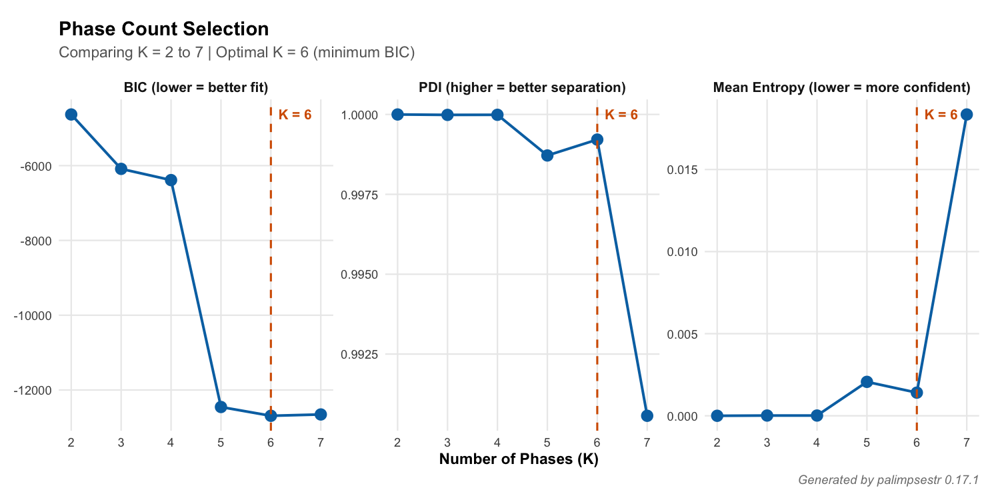
```

## Phase composition

A four-event model with Harris constraint, taphonomic weighting, the per-phase categorical class model, and a noise component recovered groupings coherent with the site periodisation (Table \ref{tab:vrpg-phases}). The per-phase class profiles returned by \texttt{phase\_composition()} are reported alongside the event sizes: every macro-event is dominated by ceramic material (as expected for the assemblage), with the secondary classes distinguishing them --- metal and construction material in the deepest event, amphorae and glass in the intermediate events, and a near-pure ceramic group corresponding to the typologically homogeneous fraction. Mapped against the site stratigraphy, the deepest event groups Pre-Roman and residual material, the intermediate events capture Late Imperial and Late Antique structural deposits, and the shallowest, dominant event corresponds to the Late Antique cemetery.

\begin{table}[H]
\centering
\caption{VRPG phase composition (K=4, v0.17, per-phase categorical class model). Class shares are the estimated per-phase profiles from \texttt{phase\_composition()}; phases are ordered by mean depth (1 = deepest).}\label{tab:vrpg-phases}
\small
\begin{tabular}{clrrl}
\toprule
Phase & Macro-event & N & \% & Dominant material classes (share) \\
\midrule
1 & Pre-Roman + residual & 119 & 19.3 & Ceramic 40\%, metal 14\%, construction 11\% \\
2 & Homogeneous ceramic group & 41 & 6.7 & Ceramic 91\%, amphorae 3\%, construction 3\% \\
3 & Late structural deposits & 135 & 22.0 & Ceramic 55\%, amphorae 20\%, glass 12\% \\
4 & Late Antique cemetery & 320 & 52.0 & Ceramic 81\%, amphorae 12\%, construction 4\% \\
\bottomrule
\end{tabular}
\end{table}

The model achieved $PDI = 0.999$ with mean entropy $0.002$, and the noise component identified 10 finds (1.6\%) as probable out-of-context items. The per-phase class profiles are shown as a heatmap in Figure \ref{fig:composition}. Crucially, all 54 stratigraphic units remained internally coherent (every unit assigned to a single phase). This contrasts with the legacy one-hot Gaussian class model, which split 27 of the 54 units across multiple phases (Figure \ref{fig:coherence}) --- a fragmentation driven by material class rather than stratigraphy, and a direct illustration of the methodological correction introduced by the categorical class model.

```{r composition, fig.cap="\\label{fig:composition}VRPG: per-phase class composition from gg\\_phase\\_composition(). Each tile is the estimated probability that a find assigned to a phase (rows) belongs to a material class (columns); rows sum to 1. All macro-events are ceramic-dominated, with the secondary classes distinguishing them."}
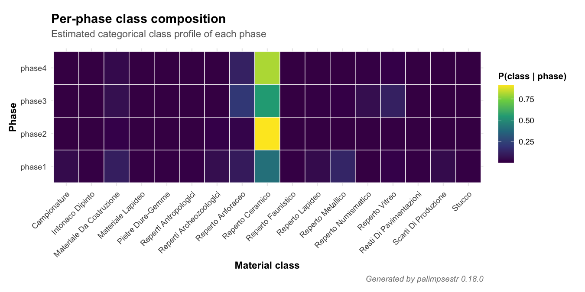
```

```{r coherence, fig.cap="\\label{fig:coherence}VRPG: within-unit phase coherence from gg\\_unit\\_coherence(), comparing the per-phase categorical class model (this fit) with the legacy one-hot Gaussian model. The categorical model keeps all 54 stratigraphic units coherent; the one-hot model splits 27 of them across phases by typology."}
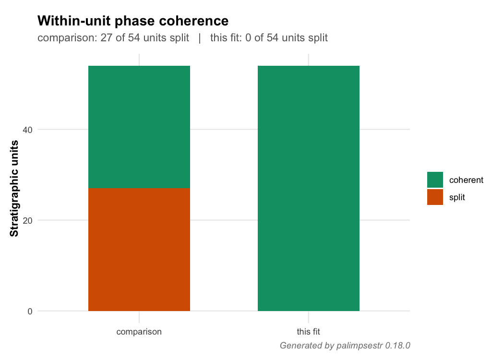
```

## EM convergence

The EM optimisation converges to a stable log-likelihood within about 30 iterations, and the package retains the best of ten random initialisations; the convergence trace is shown in the Appendix (Figure \ref{fig:convergence}).

## Spatial diagnostics

The phase-field map (Figure \ref{fig:phasefield}) reveals the spatial distribution of the four events on the excavation grid. The Late Antique cemetery (Event 4) dominates the principal excavated area; Pre-Roman finds (Event 1, in orange) are concentrated in the deeper areas around US 210; the Late Imperial structural deposits (Event 2) and the specialised/residual group (Event 3) are scattered between the cemetery and the abandoned residential structures.

```{r phasefield, fig.cap="\\label{fig:phasefield}VRPG: dominant phase assignment from gg\\_phasefield(). Each point is a find; colour indicates phase, point size reflects assignment confidence (inverse entropy)."}
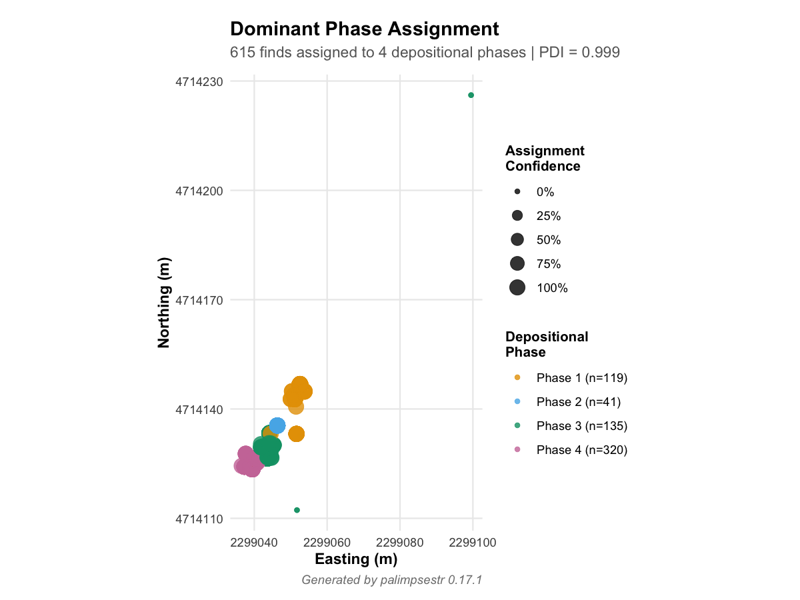
```

The entropy map (Figure \ref{fig:entropy}, Appendix) shows that phase assignments are highly confident across the dataset: entropy values approach zero almost everywhere. At this site that confidence is principally a property of the recording resolution rather than of the model: because coordinates and dates are recorded at stratigraphic-unit level, the 615 finds occupy only 54 distinct positions in the numeric feature space, and those 54 unit-points are well separated into the four macro-events. The model is therefore (correctly) certain about the macro-event of each unit. Recovering genuine within-unit uncertainty --- and hence informative entropy and PDI at the find level --- would require find-level coordinates and per-find typological dating; the package's \texttt{recommend\_setup()} flags this limitation explicitly for the present dataset. Where such resolution is available, the optional \texttt{chrono\_uncertainty} treatment propagates the dating-interval width into the entropy, so that coarsely dated finds are no longer reported as falsely certain.

The energy map (Figure \ref{fig:energy}) is more informative: ESE values vary across the site, with elevated values in zones where finds of different phases are spatially adjacent. These zones correspond to known levelling and accumulation deposits where the cemetery overlaid earlier structures.

```{r energy, fig.cap="\\label{fig:energy}VRPG: Excavation Stratigraphic Energy (ESE) field from gg\\_energy(). Dark = stable deposit (find surrounded by same-phase neighbours); bright = local disruption zone."}
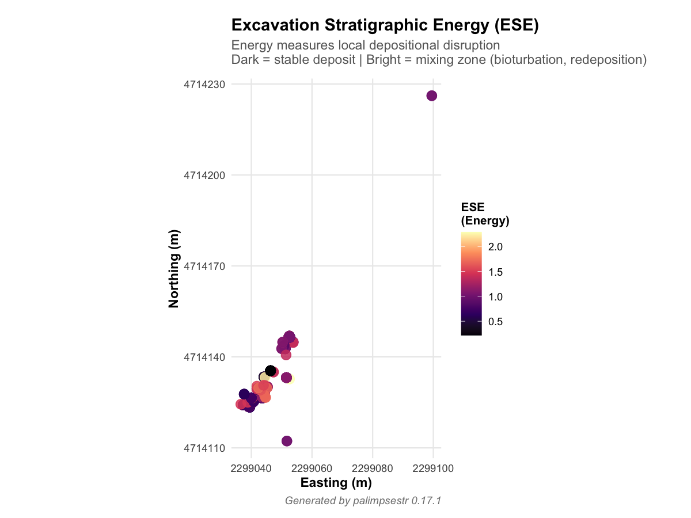
```

## Intrusion detection

The intrusion-probability map (Figure \ref{fig:intrusions}) flags 10 finds whose noise-component posterior exceeds 0.5, and the same posterior is shown as a non-spatial ranking in the Appendix (Figure \ref{fig:outliers}). Because this is the posterior of a uniform background component rather than a rescaled composite, the score is a genuine probability of being out of context and identifies items that fit none of the four macro-events well --- predominantly atypical material in otherwise homogeneous contexts. The directional classification reports all dated finds as \emph{in-context}, the expected outcome when the chronology is unit-tied: with a single date interval per unit, no find can be older or younger than its own unit's envelope, and \texttt{recommend\_setup()} anticipates this. Directional residual/intrusion diagnostics (\texttt{gg\_direction()}) become informative only with per-find typological dating.

Read archaeologically, the ten flagged finds cluster in five stratigraphic units (US 21, 173, 204, 276, 302) and are predominantly non-ceramic --- fragments of building material and an amphora, and an isolated metal object --- standing out within the ceramic-dominated assemblages of their macro-events. It is therefore material-class atypicality and spatial isolation, not chronological mismatch, that drives the flag here: a pattern consistent with redeposited construction debris and residual items caught up in accumulation deposits. Examined against the excavators' field knowledge, these flags were judged archaeologically coherent --- the noise component surfaces precisely the kind of out-of-place material a specialist would single out for re-examination, while leaving the bulk of each homogeneous unit untouched. This is the appropriate level of inference for unit-resolution recording: the model isolates atypical items without over-fragmenting the deposits that contain them.

```{r intrusions, fig.cap="\\label{fig:intrusions}VRPG: intrusion detection from gg\\_intrusions(top\\_n = 10). Circled, labelled finds are the highest-scoring suspects; under the noise component the score is the posterior probability of the uniform background component."}
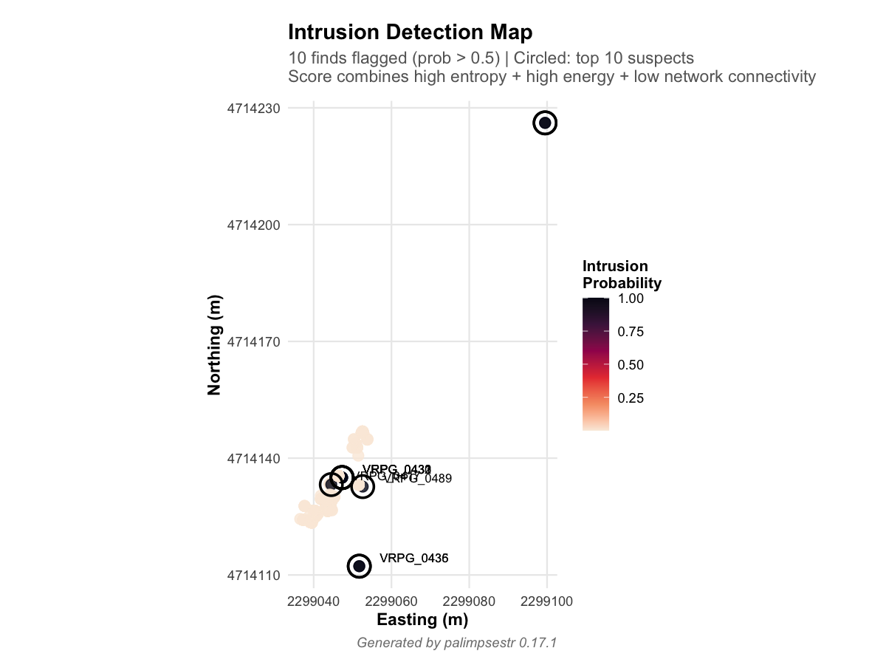
```

## Vertical phase profile

The vertical profile (Figure \ref{fig:profile}) shows that the four phases occupy stratigraphically coherent depth ranges, with Phase 4 (Late Antique cemetery, in pink) at the shallowest levels and Phase 1 (Pre-Roman + residual, in orange) at the deepest. The partial overlap between Phases 2 and 3 reflects the spatial proximity of structural collapses and accumulation deposits.

```{r profile, fig.cap="\\label{fig:profile}VRPG: vertical phase profile from gg\\_phase\\_profile(). Depth (z) on vertical axis, easting on horizontal axis; colours indicate phases. The stratigraphic ordering of phases is preserved by the model."}
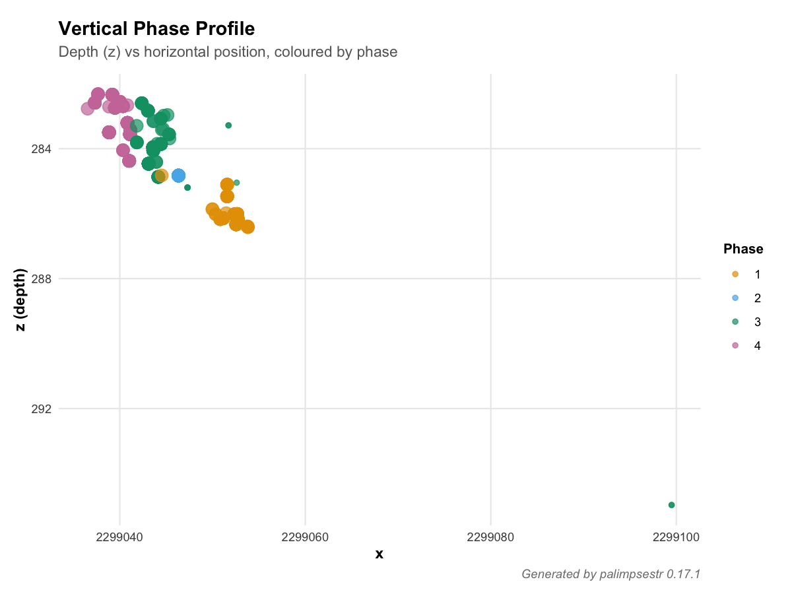
```

## Maps on excavation plan

The function \texttt{gg\_map()} overlays model output on the actual excavation plan geometries imported from the PyArchInit database. Figure \ref{fig:map-phase} shows the dominant phase per US polygon. The same helper renders thematic per-US maps of mean entropy (Figure \ref{fig:map-entropy}), mean ESE (Figure \ref{fig:map-energy}), and mean intrusion probability (Figure \ref{fig:map-intrusion}); these three are collected in the Appendix to keep the main text concise.

```{r map-phase, fig.cap="\\label{fig:map-phase}VRPG: dominant phase per US polygon (gg\\_map, layer = 'phase'). US polygons are coloured by their dominant phase; individual finds are overlaid as points."}
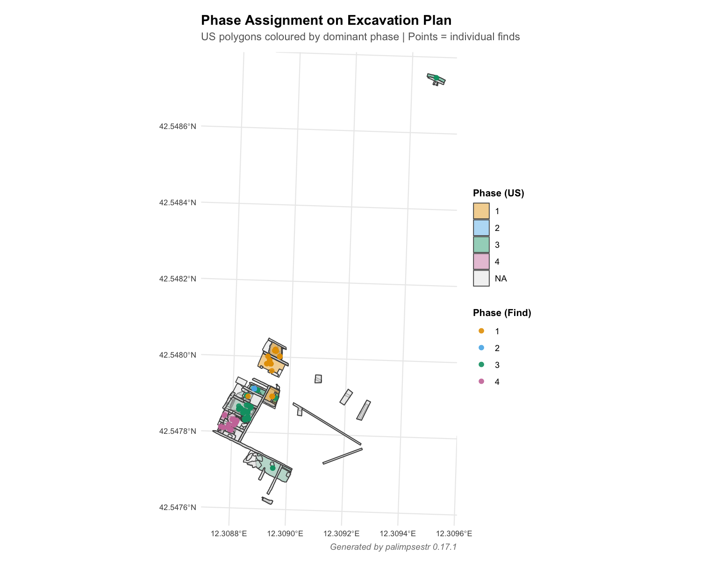
```

## Validation against the excavator's interpretation

The known levelling fills and accumulation layers at the site (US 76, US 287, US 297, US 307) had been identified on stratigraphic grounds by the second author (Roberto Montagnetti, on-site coordinator of the Poggio Gramignano excavations):

- **US 307**: a levelling layer with material from various periods quarried from adjacent areas;
- **US 287**: an accumulation layer with multi-period material;
- **US 76**: a levelling fill used to raise floor levels;
- **US 304**: a combustion deposit inside a *dolium*-fragment hearth, whose heterogeneity is functional rather than depositional.

The way these units enter the model differs from earlier versions, and the difference is instructive. Under the legacy one-hot class model their typological heterogeneity drove a low unit purity, so they surfaced as low-purity "palimpsest" units; but the same mechanism also fragmented many genuinely coherent units, making purity an unreliable signal. Under the corrected categorical model every unit is assigned coherently, and the residual character of these fills is instead encoded through their taphonomic scores --- lowered (from 0.7 to 0.3--0.4) on the basis of the on-site interpretation to reflect the redeposited nature of their material --- which down-weight them in the phase estimation, and, where atypical, through the noise component. This is the appropriate level of inference for unit-resolution data: the model cannot resolve mixing \emph{within} a unit whose finds share a single coordinate and date, but it correctly keeps stratigraphic units intact, ranks them by taphonomic reliability, and isolates unit-level outliers. Detecting within-unit palimpsests would require find-level recording, which motivates the planned case study on a higher-resolution deposit (Section "Future development").

# Limitations and future development

Field testing on the case study highlighted several limitations and motivated the methodological developments summarised below.

## Limitations

- **Horizontal-stratigraphy assumption**: the model treats the vertical coordinate $z$ as a proxy for relative chronological position. This assumption is valid only when the deposit accumulates by sub-horizontal strata, undisturbed by significant anthropogenic features. It is **not valid** for inclined deposits, slope-collapses, the fills of cuts (pits, ditches, post-holes), or terraced sediments, where finds at different $z$ values may belong to a single depositional event. The taphonomic score partly compensates by down-weighting fills (typically taf $<$ 0.5), but users should be aware that the model is most reliable on horizontally stratified deposits and apply caution in geometrically complex contexts. The same caveat applies to the depth-ordering helper \texttt{harris\_from\_contexts()}, which encodes this verticality rule by default: because the rule is frequently violated (fills of cuts, multi-period contexts), its \texttt{exclude\_contexts} argument now exempts the affected units from the penalty, and an explicitly recorded Harris matrix (\texttt{read\_harris()}) should be preferred wherever the stratigraphic relations are known.
- **Resolution-bound inference**: the achievable phase resolution is bounded by the spatial and chronological resolution of the data. When finds inherit stratigraphic-unit centroid coordinates and unit-tied dates (as in the case study), the model can only resolve phases at the unit and macro-event level, and find-level entropy/PDI become uninformative (saturating near 0 and 1 respectively) --- a property of the recording, not of the model. \texttt{recommend\_setup()} detects and reports this situation. Find-level recording and per-find typological dating are required to recover within-unit mixing.
- **Functional vs. depositional mixing**: the model flags heterogeneous or outlying material even when the heterogeneity is functional (e.g. a hearth such as VRPG US 304). Distinguishing functional mixing from disturbance requires excavator interpretation.
- **Direction diagnostics require per-find dating**: the *older-* / *younger-than-context* classification (introduced in v0.13) is informative only when finds within a unit carry distinct chronologies; under unit-tied dating every find is necessarily in-context.
- **Diagonal covariance**: the assumption of conditional independence between numeric features within phases is conservative; full-covariance variants are not currently implemented.
- **SEI normalisation is within-dataset**: absolute SEI values are not comparable across sites. Cross-site comparisons should rely on derived statistics (PDI, mean entropy, ARI).
- **Scalability**: the SEI and ESE matrices are $O(n^2)$ in memory; for $n > 2000$ users should employ \texttt{sei\_sparse()} or the \texttt{max\_dist} parameter.

## Sources of relative-chronological uncertainty

The framework treats *phase overlap* --- the chronological intersection between depositional events --- as the principal chronological challenge: it enters the SEI through the overlap ratio $O_t$ (Eq.\ \eqref{eq:sei}) and the mixture through the temporal features. Beyond it, at least three further sources of relative-chronological uncertainty bear on palimpsest analysis (Crema and Kobayashi 2020; Crema 2024); we set out how each is, or is not, currently addressed.

- **Phase-assignment uncertainty** --- the uncertainty in attributing a given find to a particular phase --- is the one the SEF model represents *directly*: it is exactly the soft posterior $p_{ik}$, summarised per find by the Shannon entropy $H_i$ (Eq.\ \eqref{eq:entropy}) and, for out-of-context items, by the noise-component probability. Far from being neglected, it is a primary output of the framework.

- **Within-phase uncertainty** --- when, within a phase's span, a given event actually occurred --- is only partly handled. The optional \texttt{chrono\_uncertainty} treatment propagates each find's dating-interval width into the temporal likelihood (as a measurement variance $(t_{\max}-t_{\min})^2/12$), so coarsely dated finds are not reported as falsely precise; but the model does not yet place a dated posterior on events located within a phase.

- **Phase-boundary uncertainty** --- the calendar dates that delimit the start and end of each phase --- is not currently modelled. SEF phases are latent clusters in the combined evidence space, not Bayesian-dated intervals in the sense of \texttt{OxCal}-style phase models (Bronk Ramsey 2009). The \texttt{chronology\_from\_rcarbon()} and \texttt{chronology\_from\_oxcal()} adapters already allow calibrated and modelled dates to feed the temporal features; propagating the *calendar* uncertainty of phase boundaries into the assignment --- for example through an aoristic or Bayesian treatment (Crema 2024) --- is a natural next step (Section "Future development").

The type-longevity estimation, calibrated-radiocarbon integration, and Bayesian extensions outlined below are steps in this direction.

## Relation to alternative approaches

The SEF framework is best positioned by contrast with the four families of methods archaeologists currently bring to bear on mixed deposits, each of which addresses one facet of the problem that SEF integrates.

*Spatial clustering.* Coordinate-based methods such as $k$-means (Kintigh and Ammerman 1982) and density- or point-pattern-based approaches partition finds by location alone. They isolate spatial concentrations effectively but are blind to chronology and typology and return hard assignments with no measure of redeposition. SEF retains the spatial signal as one of four evidence domains and replaces the hard partition with a soft, per-find posterior.

*Model-based and mixed-type clustering.* SEF is, formally, a finite-mixture model and therefore a relative of general model-based clustering (Fraley and Raftery 1998) and of latent-class and mixed-type mixtures that combine continuous and categorical variables. What distinguishes it is not the inferential machinery but the archaeological structure built into it: a Gaussian-times-multinomial likelihood matched to the evidence types (Eq.\ \eqref{eq:mixture}), taphonomic down-weighting of disturbed finds, a Harris-matrix stratigraphic penalty, chronological-overlap features, and a uniform noise component for out-of-context items. SEF can thus be read as a domain-specific specialisation of model-based clustering in which a generic clustering routine would ignore exactly the stratigraphic and taphonomic information that governs palimpsest formation.

*Bayesian chronological modelling.* Radiocarbon-based phase models (Bronk Ramsey 2009; Crema and Bevan 2021) and aoristic methods (Crema 2024) model calendar time and phase boundaries with a rigour SEF does not attempt: SEF phases are latent clusters in the combined evidence space, not Bayesian-dated intervals (Section "Sources of relative-chronological uncertainty"). The two are complementary rather than competing --- the \texttt{chronology\_from\_oxcal()} and \texttt{chronology\_from\_rcarbon()} adapters let modelled or calibrated dates feed the SEF temporal features --- and the integration of boundary dating into the assignment is identified above as future work.

*Stratigraphic recording and visualisation.* The Harris Matrix (Harris 1989) and find-plotting tools such as SEAHORS (Royer et al. 2023) and archeoViz (Plutniak 2023) record or display stratigraphic relations and piece-plotted finds but provide no quantitative measure of phase coherence or redeposition. SEF is designed to complement, not replace, these tools: it consumes their output --- an explicit Harris matrix via \texttt{read\_harris()}, piece-plotted coordinates --- and adds the probabilistic layer they lack.

Across all four families, the distinctive contribution of SEF is the *joint* treatment of spatial, vertical, chronological, and cultural evidence within a single probabilistic model whose primary output is a per-find redeposition score and its aggregation to unit- and event-level palimpsest measures.

## Methodological development since the first release

Field testing motivated a sequence of methodological refinements, all of which are optional or backward-compatible at their defaults. An initial set of feature-space enhancements (chronological precision weighting, residuality detection, class scaling, taphonomic score as a feature, sub-class encoding) was followed by a more thorough revision of the statistical core:

1. **Active, cross-validatable weights**: the domain weights $w_s, w_z, w_t, w_c$ now scale the feature dimensions and enter the mixture likelihood, so \texttt{optimize\_weights()} can select them by cross-validated held-out log-likelihood (with a Jacobian correction that makes configurations comparable).
2. **Bounded, scale-invariant similarity kernels**: the spatial and vertical SEI/ESE components use exponential kernels with data-driven bandwidths, removing the dependence on the site's measurement unit and the sensitivity to coincident coordinates.
3. **Per-phase categorical class model** (default): replacing one-hot Gaussian columns, this prevents typology from fragmenting stratigraphic units and yields interpretable per-phase class profiles (\texttt{phase\_composition()}). On the case-study data it reduced the number of units split across phases from 27 to 0.
4. **Genuine likelihood-based model selection**: BIC and ICL are computed from the unpenalised mixture density and account for the categorical and noise parameters.
5. **Per-find chronological uncertainty** (\texttt{chrono\_uncertainty}) and **dynamic Neighborhood-EM stratigraphic field** (\texttt{strat\_dynamic}), which propagate dating-interval widths and recompute the stratigraphic constraint from the current posteriors, respectively.
6. **Noise / outlier component** (\texttt{noise}): a uniform background component yielding a genuine posterior probability of intrusion and robust phase estimation.
7. **Directional intrusion diagnostics** and a **setup adviser** (\texttt{recommend\_setup()}) that reports data-resolution caveats; **type-longevity** estimation (\texttt{type\_longevity()}, \texttt{gg\_longevity()}); and an **rcarbon adapter** (\texttt{chronology\_from\_rcarbon()}) for calibrated $^{14}$C dates. An **OxCal adapter** (\texttt{chronology\_from\_oxcal()}) provides the same service for OxCal-modelled dates, and the intrusion diagnostic couples the noise-component magnitude with the chronological direction in an \texttt{intrusion\_type} classification.

## Future development

Several further developments are planned in response to user feedback (notably from M. Cattani, see Acknowledgements) and to the limitations discussed above:

- **Validation on find-resolution, dendrochronologically dated sites**: the Poggio Gramignano case study uses unit-level recording with periodisation-based dating. To exercise the find-level machinery (within-unit entropy, directional intrusions, chronological-uncertainty propagation) a future case study is planned on the Lago Lucone pile-dwelling site (Gavardo, BS, Italy), where piece-plotted finds and dendrochronological dating provide yearly-resolved, find-level anchors for the Bronze Age occupation. Such a dataset would allow direct evaluation of how recording resolution translates into phase-recovery accuracy.
- **Within-class structure**: automated detection of sub-typological structure within homogeneous classes.
- **Methodological extensions**: full-covariance and fully Bayesian variants of the mixture model; and spatial-autocorrelation-aware likelihoods.

The package will continue to be developed in response to user feedback through the GitHub issue tracker.

# Conclusion

\texttt{palimpsestr} fills a long-standing methodological gap between qualitative stratigraphic reasoning and quantitative spatial analysis. By jointly modelling spatial proximity, vertical distribution, chronological overlap, and cultural similarity, the Stratigraphic Entanglement Field framework produces soft phase assignments that acknowledge --- rather than suppress --- the inherent uncertainty of mixed deposits. The three diagnostic statistics (SEI, ESE, PDI) provide interpretable summaries at the find, deposit, and assemblage levels respectively, and the package is fully integrated with established archaeological data sources (CSV, Excel, SQLite, PostgreSQL, PyArchInit) and GIS workflows (\texttt{sf}, GeoPackage, QGIS). The Shiny dashboard makes the framework accessible to archaeologists without R programming experience.

The Poggio Gramignano case study illustrates both the framework's strengths and the central role of recording resolution. On temporally diverse deposits with rich material categories the model recovers four archaeologically coherent macro-events, keeps every stratigraphic unit internally consistent, ranks units by taphonomic reliability, isolates unit-level outliers through the noise component, and produces interpretable visual outputs that integrate directly with excavation plan geometries. It also makes explicit, through \texttt{recommend\_setup()}, that unit-level coordinates and unit-tied dating cap the inference at the unit and macro-event level --- a transparency that guides the analyst towards the find-level recording needed to resolve within-unit palimpsests. \texttt{palimpsestr} is intended as a complement to, not a substitute for, the Harris Matrix and traditional stratigraphic recording: it adds a quantitative, probabilistic layer of analysis that operates, where the data allow, at the find level --- precisely the scale at which palimpsest formation is most problematic and least well-served by existing tools.

# Appendix: Supplementary figures {-}

The figures below complement the case study (Section "Case study: Poggio Gramignano"). They are referenced from the main text and collected here to keep that section concise: the EM convergence trace, the find-level entropy map, the non-spatial intrusion ranking, and the three thematic per-US maps (entropy, ESE, and intrusion probability).

```{r convergence, fig.cap="\\label{fig:convergence}EM convergence trace for the K = 4 model. The log-likelihood stabilises within 30 iterations, indicating a robust local optimum. The package retains the best-of-10 random initialisations."}
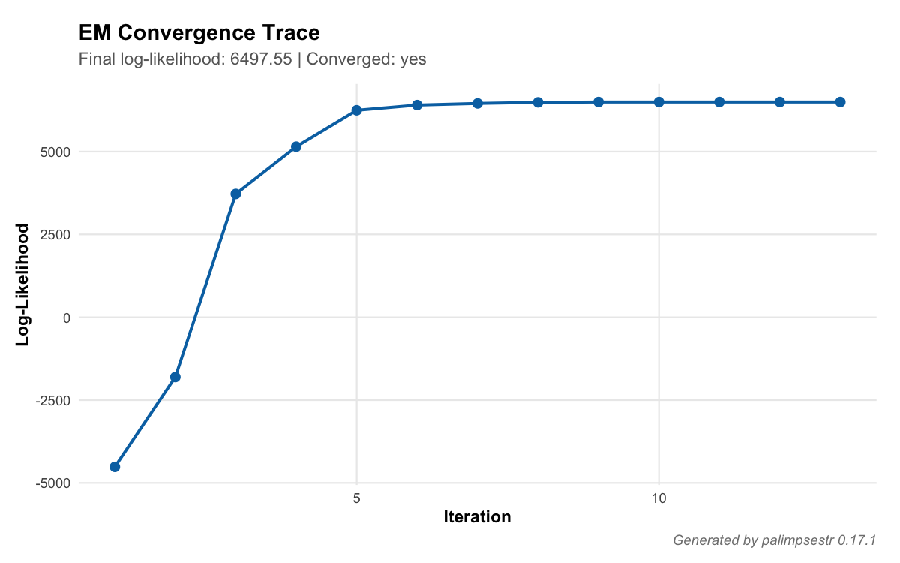
```

```{r entropy, fig.cap="\\label{fig:entropy}VRPG: spatial distribution of Shannon entropy from gg\\_entropy(). Dark = confident assignment to a single phase; bright = ambiguous assignment. Entropy is uniformly low, indicating high model confidence."}
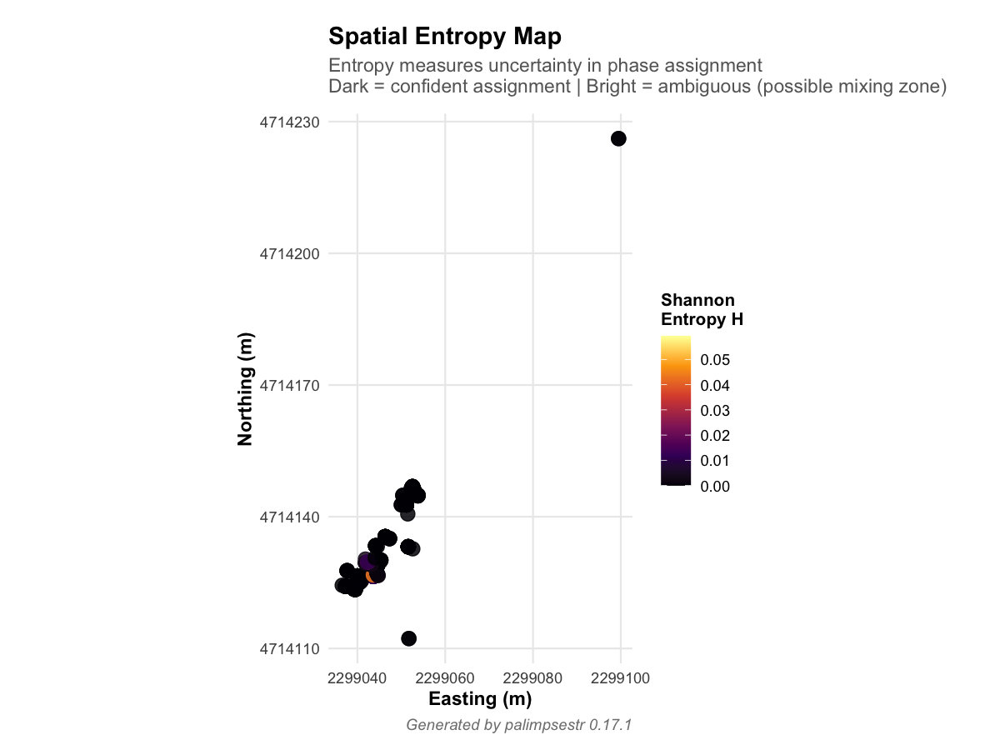
```

```{r outliers, fig.cap="\\label{fig:outliers}VRPG: intrusion ranking from gg\\_outliers(top\\_n = 15). Per-find noise-component posterior, sorted; the dashed line marks the 0.5 threshold. Unlike a rescaled composite, the posterior is an absolute probability and is not forced to span the full [0, 1] range."}
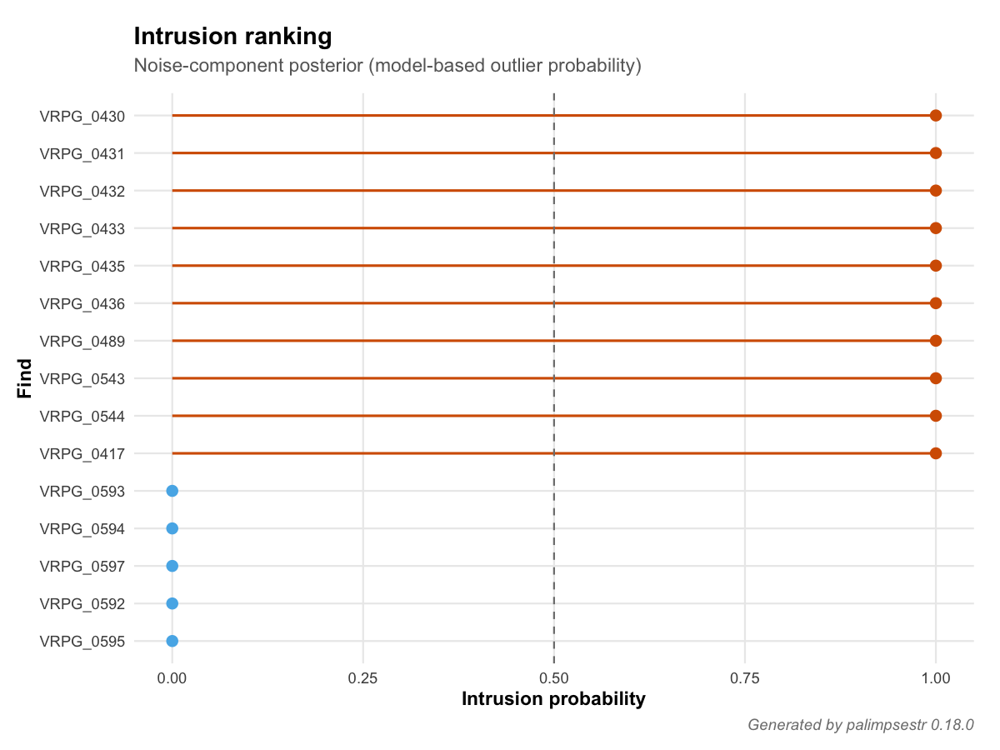
```

```{r map-entropy, fig.cap="\\label{fig:map-entropy}VRPG: mean entropy per US polygon (gg\\_map, layer = 'entropy'). Bright zones flag US with mixed-phase finds (potential palimpsests)."}
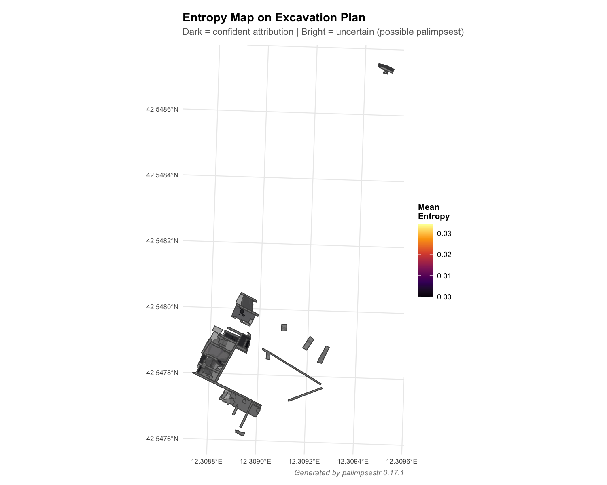
```

```{r map-energy, fig.cap="\\label{fig:map-energy}VRPG: mean ESE per US polygon (gg\\_map, layer = 'energy'). Bright zones indicate US with high local stratigraphic disruption."}
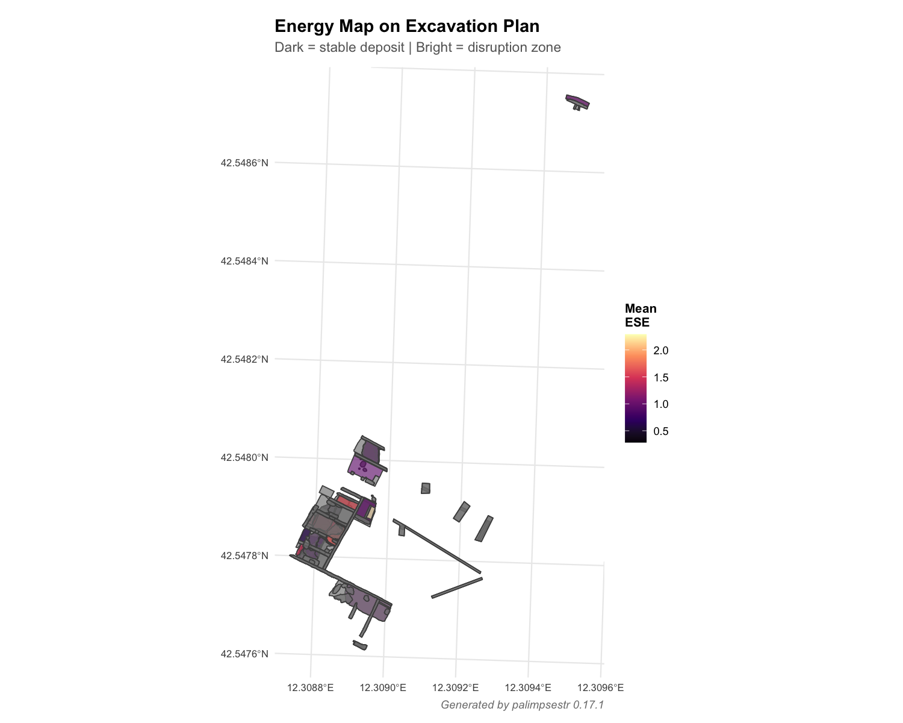
```

```{r map-intrusion, fig.cap="\\label{fig:map-intrusion}VRPG: mean intrusion probability per US polygon (gg\\_map, layer = 'intrusion'). Highlights US containing potentially redeposited or out-of-context finds."}
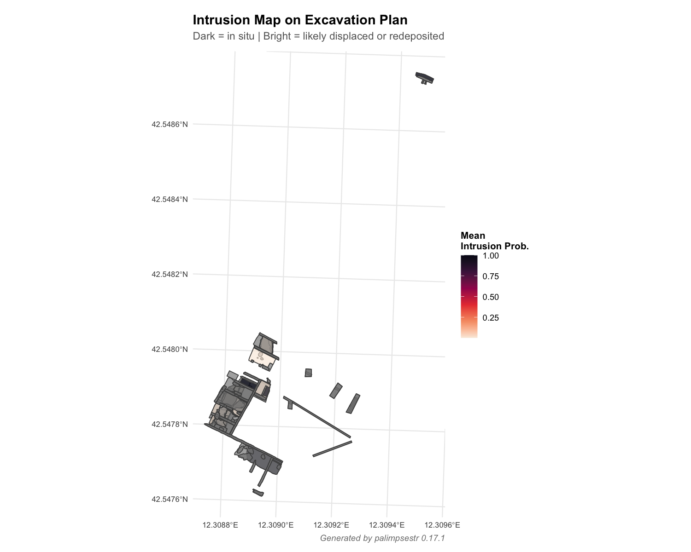
```

# Data, script, code, and supplementary information availability

The \texttt{palimpsestr} package (version 0.24.0 used in this paper) is publicly available at \url{https://github.com/enzococca/palimpsestr} under the MIT licence and permanently archived on Zenodo with concept DOI \url{https://doi.org/10.5281/zenodo.19881542}. The \texttt{villa\_romana} dataset, derived from the Poggio Gramignano excavation, is bundled with the package. The case-study figures were produced with the reproducibility script available in the repository (\texttt{docs/regen\_casestudy\_v017.R}); the SEF model is unchanged since version 0.17.1, so they reproduce identically under 0.24.0. From version 0.20.0, \texttt{read\_pyarchinit()} ingests pyArchInit databases directly, and a set of QGIS Processing algorithms with a self-installing pyArchInit tab runs the full pipeline --- fitting, intrusion detection, and a narrated PDF/DOCX report (\texttt{export\_sef\_report()}) --- from within QGIS (\texttt{qgis/} folder).

# Author contributions

E.C. designed and implemented the \texttt{palimpsestr} package, the Stratigraphic Entanglement Field framework, and the Shiny dashboard, and wrote the manuscript. R.M. directed the archaeological excavations at Poggio Gramignano (Lugnano in Teverina), provided the dataset and the taphonomic scores per stratigraphic unit, validated the model output against on-site stratigraphic interpretation, and contributed to the discussion of methodological limitations and feature-space improvements. M.C. provided in-depth methodological supervision throughout the development of the framework, contributed to the formulation of the archaeological interpretation of the diagnostics (the redeposition score, the unit-level palimpsest measure, and the type-longevity outlook), highlighted the implicit assumption of horizontal stratigraphy, introduced the distinction between *older-than-context* (residual) and *younger-than-context* (latent feature) intrusions in the roadmap, and identified the future case study on dendrochronologically dated pile-dwellings as the appropriate validation context.

# Acknowledgements

We thank Professor David Soren (University of Arizona), David Pickel (Stanford University) and the wider Poggio Gramignano excavation team for the long-term archaeological work that produced the dataset analysed here. The development of \texttt{palimpsestr} benefited from the open-source archaeological computing community, particularly the maintainers of \texttt{sf}, \texttt{ggplot2}, \texttt{plotly}, and the PyArchInit project. Preprint version 2 of this article has been peer-reviewed and recommended by Peer Community In Archaeology (\url{https://doi.org/10.24072/pci.archaeo.101019}; Palmisano, 2026).

# Funding

This research received no specific grant from any funding agency in the public, commercial, or not-for-profit sectors.

# Conflict of interest disclosure

The authors declare no conflict of interest relating to the content of this article.

# References

\noindent
Ambroise, C., & Govaert, G. (1997). Constrained clustering and Kohonen self-organizing maps. *Journal of Classification*, 14(2), 215--237. \url{https://doi.org/10.1007/s003579900012}

\noindent
Bailey, G. (2007). Time perspectives, palimpsests and the archaeology of time. *Journal of Anthropological Archaeology*, 26(2), 198--223. \url{https://doi.org/10.1016/j.jaa.2006.08.002}

\noindent
Biernacki, C., Celeux, G., & Govaert, G. (2000). Assessing a mixture model for clustering with the integrated completed likelihood. *IEEE Transactions on Pattern Analysis and Machine Intelligence*, 22(7), 719--725. \url{https://doi.org/10.1109/34.865189}

\noindent
Bronk Ramsey, C. (2009). Bayesian analysis of radiocarbon dates. *Radiocarbon*, 51(1), 337--360. \url{https://doi.org/10.1017/S0033822200033865}

\noindent
Cocca, E. (2026). \texttt{palimpsestr}: Probabilistic Decomposition of Archaeological Palimpsests. R package version 0.24.0. Zenodo. \url{https://doi.org/10.5281/zenodo.19881542}

\noindent
Conolly, J., & Lake, M. (2006). *Geographical Information Systems in Archaeology*. Cambridge Manuals in Archaeology. Cambridge: Cambridge University Press. ISBN 978-0-521-79744-3. \url{https://doi.org/10.1017/CBO9780511807459}

\noindent
Crema, E. R. (2024). A Bayesian alternative for aoristic analyses in archaeology. *Archaeometry*, 67(S1), 7--30. \url{https://doi.org/10.1111/arcm.12984}

\noindent
Crema, E. R., & Bevan, A. (2021). Inference from large sets of radiocarbon dates: software and methods. *Radiocarbon*, 63(1), 23--39. \url{https://doi.org/10.1017/RDC.2020.95}

\noindent
Crema, E. R., & Kobayashi, K. (2020). A multi-proxy inference of J\=omon population dynamics using Bayesian phase models, residential data, and summed probability distribution of $^{14}$C dates. *Journal of Archaeological Science*, 117, 105136. \url{https://doi.org/10.1016/j.jas.2020.105136}

\noindent
Dempster, A. P., Laird, N. M., & Rubin, D. B. (1977). Maximum likelihood from incomplete data via the EM algorithm. *Journal of the Royal Statistical Society: Series B (Methodological)*, 39(1), 1--22. \url{https://doi.org/10.1111/j.2517-6161.1977.tb01600.x}

\noindent
Fraley, C., & Raftery, A. E. (1998). How many clusters? Which clustering method? Answers via model-based cluster analysis. *The Computer Journal*, 41(8), 578--588. \url{https://doi.org/10.1093/comjnl/41.8.578}

\noindent
Harris, E. C. (1989). *Principles of Archaeological Stratigraphy* (2nd ed.). London and San Diego: Academic Press. ISBN 978-0-12-326651-4.

\noindent
Kintigh, K. W., & Ammerman, A. J. (1982). Heuristic approaches to spatial analysis in archaeology. *American Antiquity*, 47(1), 31--63. \url{https://doi.org/10.2307/280052}

\noindent
Lucas, G. (2012). *Understanding the Archaeological Record*. Cambridge: Cambridge University Press. ISBN 978-1-107-01026-0. \url{https://doi.org/10.1017/CBO9780511845772}

\noindent
Plutniak, S. (2023). \texttt{archeoViz}: an R package for the Visualisation, Exploration, and Web Communication of Archaeological Spatial Data. *Journal of Open Source Software*, 8(92), 5811. \url{https://doi.org/10.21105/joss.05811}

\noindent
Royer, A., Discamps, E., Plutniak, S., & Thomas, M. (2023). SEAHORS: Spatial Exploration of ArcHaeological Objects in R Shiny. Zenodo, peer-reviewed and recommended by Peer Community in Archaeology. \url{https://doi.org/10.5281/zenodo.7957154}

\noindent
Schwarz, G. (1978). Estimating the dimension of a model. *The Annals of Statistics*, 6(2), 461--464. \url{https://doi.org/10.1214/aos/1176344136}

\noindent
Soren, D., & Soren, N. (Eds.). (1999). *A Roman villa and a late Roman infant cemetery: excavation at Poggio Gramignano, Lugnano in Teverina*. Roma: L'Erma di Bretschneider.
